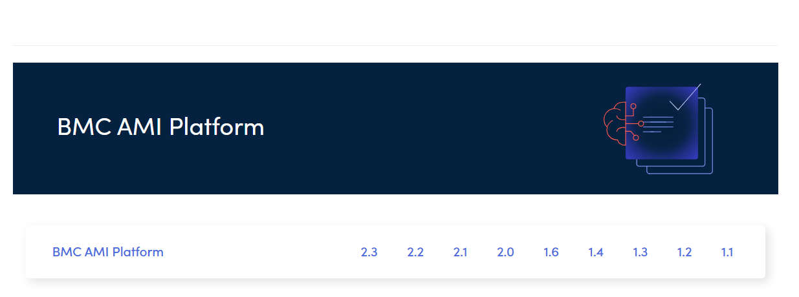

- [Heading](#heading)
  - [Heading](#heading-1)
    - [Heading](#heading-2)
- [Getting Started](#getting-started)
  - [Before you begin](#before-you-begin)
  - [Next steps](#next-steps)


# Heading
## Heading
### Heading
# Getting Started
Welcome to our product documentation.
## Before you begin
Make sure you have an active account.
## Next steps
Continue with the installation guide.

This space contains information about the 2.1.00 release of the BMC AMI Platform product. BMC AMI Platform simplifies mainframe management by integrating AI and cloud technologies. It includes generative AI (GenAI) features that are seamlessly and flexibly integrated into the platform. 
 On bash, type `git coomand`
 ```
 Test test
 ```
 [README.md](../README.md)
For more information, see
Through a dedicated UI console, the platform provides control and observability for all **connected** internal services and large language models (LLMs). BMC AMI Platform empowers IT professionals to solve complex problems, bridge knowledge gaps, and accelerate innovation using GenAI technology.
List of guides:
- gettig started guide
  
- User guide
  - overview
    - keyconcept
 
    - 
  
1. getting sterted
2. bwjdj
   1. 


|Player|Name|Country
|------|----|-------|
|1     |Ronaldo| |
|2     | Messi | Argentina|

| Player | Sports | Age | Country |
| :--- | :---: | ---: | --- |
| A | Badminton | 25 | India |
| B | Football | 26 | Argentina |


> [!NOTE]
> Make sure Git is installed before you begin.
 
> [!TIP]
> You can verify the installation by running `git --version`.
 
> [!WARNING]
> Do not close the terminal while the installation is running.


> [!Example]
> Example 


Markdown is a lightweight markup language.[^1]
 
[^1]: Markdown was created by John Gruber and Aaron Swartz.
 
Markdown is commonly used for documentation.[^1]
GitHub supports GitHub FlavoredMarkdown (GFM).[^2]
 
[^1]: Markdown is designed to be easy to read and write.
[^2]: GFM extends standard Markdown with additional features.
 
 <details>
<summary>Click to expand</summary>
 
This content is hidden by default.
 
You can include following types of content:
 
- Text
- Lists
- Code
- Links
- Images
 
</details>